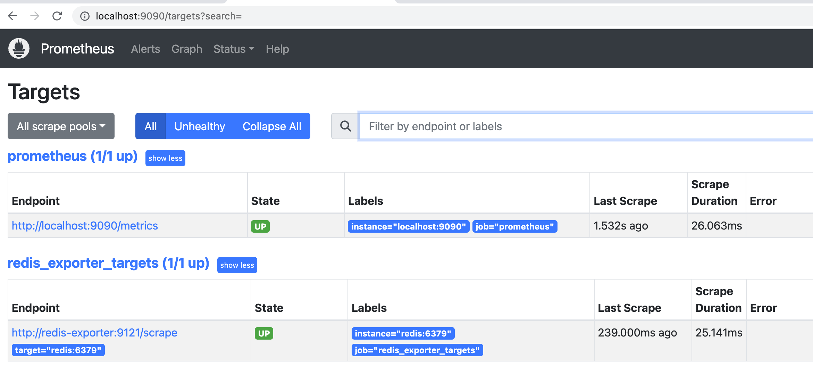
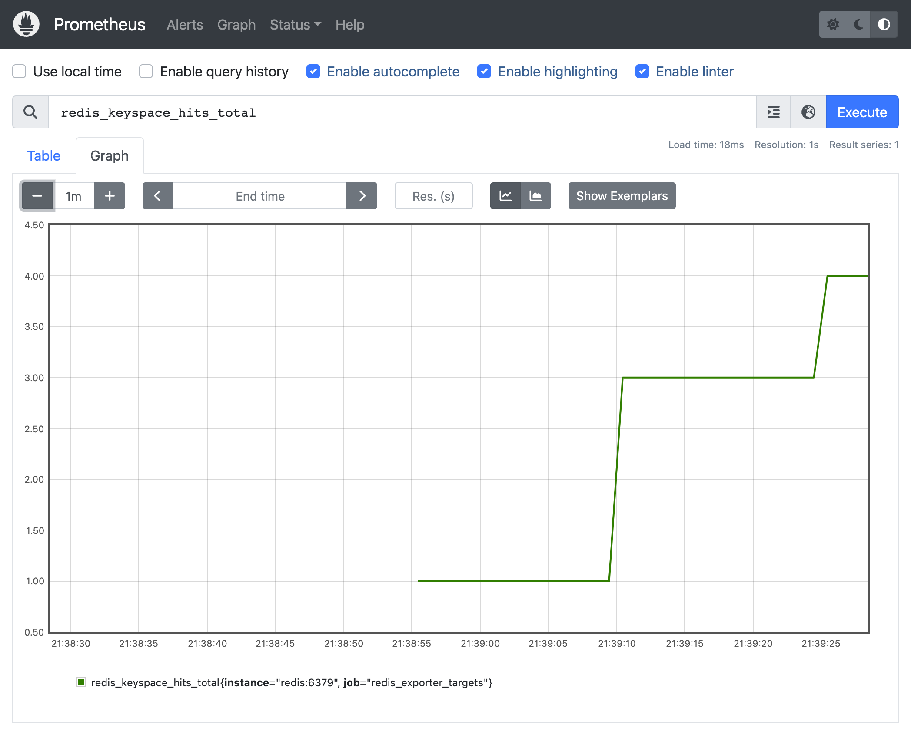

# Redis metrics into Prometheus

The goal of this project is to provide Prometheus with metrics scraped out of a Redis cluster. The list of hosts to be scraped will be provided by an endpoint of a web server.

Steps to get it running:
* `docker compose up`
* Open Prometheus (`localhost:9090`) in your browser.

Verify that Prometheus is scrapping the metrics out of `redis` using the `redis-exporter` by opening the page "Targets":

Verify that there are metrics incoming from `redis`:

